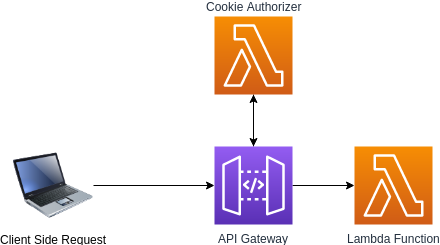

# API Gateway Cookie Based Custom Lambda Authorizer
[](https://lgtm.com/projects/g/aaronosb/cookie-authorizer-example/alerts/)
[](https://lgtm.com/projects/g/aaronosb/cookie-authorizer-example/context:javascript)
[](https://lgtm.com/projects/g/aaronosb/cookie-authorizer-example/context:python)

> This is an example of how to set up a custom lambda authorizer on an API Gateway to authenticate users/requests via Cookies instead of using the Authorization Header. This example uses the Serverless.com Framework



The main reason you may want to do this is to add an additional layer of security to your application. In order to set the Authorization header client side with your credentials (usually with a JWT) you need to expose those credentials to the client and therefore risk those credentials being compromised via an XSS attack. For more on why this is a bad idea see [this article by @rdegges](https://dev.to/rdegges/please-stop-using-local-storage-1i04). While there are reasonable countermeasures to protect your site against XSS frankly its hard to be certain you are protected, especially when you are pushing changes rapidly to your frontend and using 3rd party dependencies.

## Usage Example

For more on how to implement this Cookie Based Authorizer along with CloudFront and Lambda@Edge to build Private Serverless Web Applications check out this blog post. [Coming Soon]

## Key Implementation Details

#### Parsing cookies from request inside authorizer

> code/auth.py

```python
from http.cookies import SimpleCookie

def get_auth_token_from_cookie(event):
    try:
        cookie = SimpleCookie()
        cookie.load(event["headers"]["Cookie"])
        token = cookie["TOKEN"].value # <- TOKEN is the name of the cookie
        return token
    except:
        print("Problem retrieving Token Cookie from request")
        print(event)
        raise Exception("Problem retrieving Token Cookie from request")
```

#### CORS Settings on API Gateway Endpoints

> serverless.yml

```yaml
functions:
  example:
    handler: code/hello_world.lambda_handler
    description:
    events:
      - http:
          path: /
          method: get
          cors:
            origins:
              - https://example.com # <-- You have to specify origins wildcards will result in CORS Errors
            allowCredentials: true
          authorizer:
            name: cookieAuthFunction
            resultTtlInSeconds: 300
            type: request # <-- Make sure the authorizer type is request
```

#### Amplify/Axios withCredentials=true

> frontend/src/index.jsx

```javascript
  componentDidMount() {
    // NOTE For this to work a cookie needs to be set with your API Gateway URL included in the
    // cookies "domain" so that it can access it. You also need to set withCredentials: true
    // like below for Amplify to pass your cookie with the request

    API.get("example", "/", { withCredentials: true })
      .then(response => {
        this.setState({
          response: response
        });
      })
      .catch(error => {});
  }
```

## Acknowledgements

- [Alex DeBrie's CORS and API Gateway survival guide](https://serverless.com/blog/cors-api-gateway-survival-guide/)
- [AWS API Gateway Custom Authorizer Blueprints](https://github.com/awslabs/aws-apigateway-lambda-authorizer-blueprints)
